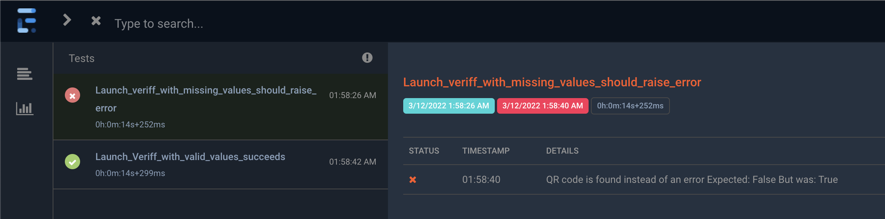
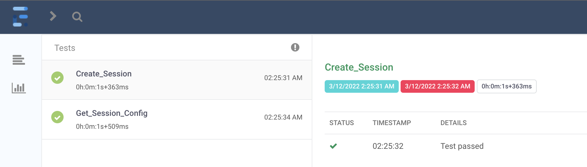

# Example QA Assessment

A real-world technical assessment from a company hiring QA / Software Testers.

## The Quality Engineer Test Task

Find the assessment instructions in this file: [quality-engineer-test.md](./qualiti-engineer-test.md)

> Give this a try yourself before looking at the solution in this repo!

### A Solution

To look at the solution I came up with, look for these files:

- Test Plan - [veriff.feature](./veriff.feature) in a Gherkin-style format
- UI Tests - [UiTests.cs](./Veriff.Tests/UiTests.cs)
- API Tests - [ApiTests.cs](./Veriff.Tests/ApiTests.cs)
- Veriff Code abstraction (pages and api) - [Veriff Project](./Veriff/)
- Bugs found - [BUGS.md](./BUGS.md)

Besides that, my solution uses:

- `C# (dotnet core)` as my language
- `NUnit` as my test framework
- `Selenium` to automate the browser
- `RestSharp` to automate the API requests

> ⏰ I gave myself 2 hours to do this

## Setup

- 🐍 **_dotnet 6_** or higher is required

1. Clone the repo

   ```bash
   git clone https://github.com/qa-at-the-point/example-qa-assessment-dotnet.git
   ```

2. Install packages

   ```bash
   # Installs all packages and dependencies
   dotnet build
   ```

## Run Tests

However, the base command is always the same:

```bash
# Run all tests
dotnet test
```

> 💡 The terminal will show test results and summary once the Test Run is complete

### Run Tests by Category

The recommended way for running tests in this framework is by specifying the API or UI suite to execute.

```bash
# API Tests
dotnet test --filter TestCategory=API
```

```bash
# UI
dotnet test --filter TestCategory=UI
```

> 💡 An `index.html` Extent Report file is generated at the Workspace Root which you can view in the browser!

For example:





### Generate XML Report

```bash
dotnet test --filter <expression> -l:"trx;LogFileName=results.xml" -r
```

> 💡 A `results.xml` file is created at the Worspace Root to be used by CI (like Jenkins!)

## Known Limitations

With a 2-hour time limit of exploring, designing, and programming, and 1 hour of documentation, I didn't have time to implement everything I'd normally do. Imagine if I was working full-time!

> 😎 Hire me and I'll have full-time to design and implement even better solutions!

- You cannot run all tests (API and UI) at the same time because of the current `BaseTest` setup
- UI Tests cannot be run in parallel as they depend on the same `IWebDriver` reference
- API and UI Test Results are separated instead of being combined in a single report
- Only `Chrome` is being tested, but that _is within scope of the assignment_
- Some values are hard-coded that probably shouldn't be. For example, the request URLs in `Veriff.Api`
- `VeriffUi.FindQRCode()` looks for the text `"QR"` on the page which won't work for _every_ language

## Submit a Bug or Request

If you've found an bug or you have an idea or feature request, please create an issue on the [Issues Tab](https://github.com/qa-at-the-point/example-qa-assessment-dotnet/issues)
